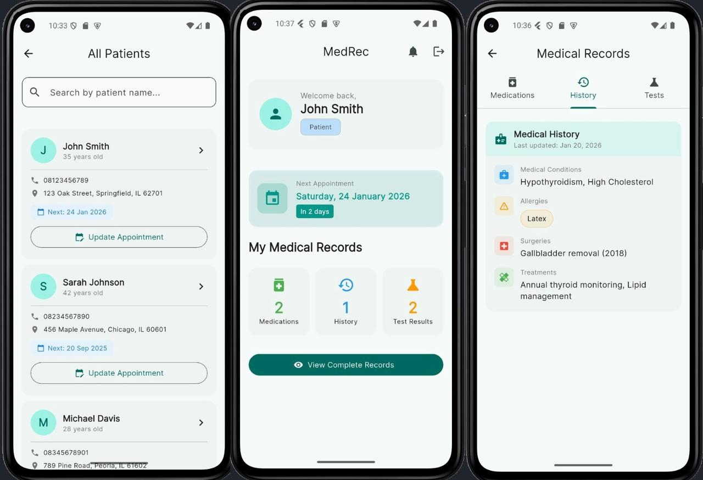
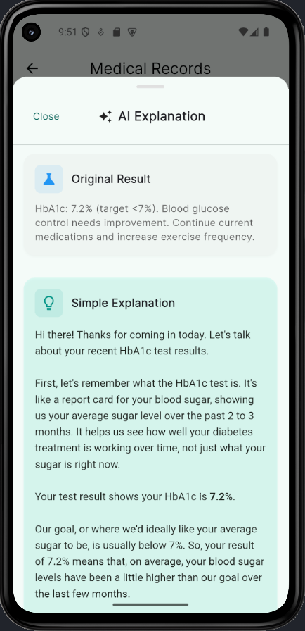

# MedRec - Medical Records Management Application

A Flutter application for managing medical records, designed for both administrators and patients to efficiently handle patient information, medications, medical history, and appointments. This application was developed specifically to streamline operations at **Puskesmas Minggir**.

## 📸 Screenshots

<p align="center">
  
  
</p>

## 📋 Features

### For Administrators
- **Patient Management**
  - Add new patients with detailed information
  - View all patients in a searchable list
  - Search patients by name with real-time filtering
  - Update patient information and appointments
  - Delete patient records
- **Medical Records Management**
  - Add, edit, and delete medications
  - Manage medical history including conditions, allergies, surgeries, and treatments
  - Track diagnostic test results
- **Appointment Scheduling**
  - Set and update patient appointments
  - Automated notification scheduling for upcoming appointments

### For Patients
- **Personal Dashboard**
  - View personal medical information
  - Quick access to medications, medical history, and test results
  - Appointment reminders and notifications
- **Medical Records Access**
  - View all medications with dosage and frequency
  - Access complete medical history
  - Review diagnostic test results

## 🚀 Getting Started

### Prerequisites
- Flutter SDK (>=3.2.0 <4.0.0)
- Dart SDK
- Android Studio / Xcode (for mobile development)
- Node.js and npm (for backend server)

### Backend Setup
This app requires a backend server. Make sure your backend API is running on:
- **Default URL**: `http://10.0.2.2:5000` (Android Emulator)
- For physical devices, update the `baseUrl` in `lib/services/api_service.dart`

### Installation

1. **Clone the repository**
```bash
git clone <repository-url>
cd medrec_app
```

2. **Install dependencies**
```bash
flutter pub get
```

3. **Update API URL (if needed)**
   - Open `lib/services/api_service.dart`
   - Update `baseUrl` to match your backend server URL

4. **Run the app**
```bash
flutter run
```

## 📱 App Structure

```
lib/
├── main.dart                      # App entry point
├── models/
│   └── models.dart               # Data models (User, Patient, Medication, etc.)
├── providers/
│   ├── auth_provider.dart        # Authentication state management
│   └── patient_provider.dart     # Patient data state management
├── routes/
│   └── app_router.dart           # Navigation configuration
├── screens/
│   ├── home_screen.dart          # Main dashboard
│   ├── login_screen.dart         # Login interface
│   ├── register_screen.dart      # Registration interface
│   ├── patient_list_screen.dart  # Patient list with search
│   ├── patient_detail_screen.dart # Patient medical records
│   └── notifications_screen.dart  # Notification management
└── services/
    ├── api_service.dart          # API communication
    └── notification_service.dart # Local notifications
```

## 🔑 Authentication

### Default Admin Account
Create an admin account through your backend or use:
- Username: `admin`
- Password: `adminpassword123` (configure in backend)

### Patient Registration
Patients can self-register or be registered by administrators with the following information:
- Username (min 3 characters)
- Password (min 8 characters)
- Full Name
- Age (0-100)
- Address (min 10 characters)
- Phone Number (must start with 08, min 10 digits)

## 📱 Platform Support

- ✅ Android (API 21+)
- ✅ iOS (iOS 12.0+)
- ⚠️ Web (Limited - notification support not available)
- ⚠️ Desktop (Limited - not fully tested)

## 🚀 Building for Production

### Android
```bash
flutter build apk --release
# or
flutter build appbundle --release
```

### iOS
```bash
flutter build ios --release
```

## 📝 License

This project is licensed under the MIT License - see the LICENSE file for details.

## 🗺️ Roadmap

### Planned Features
- [ ] Multi-language support
- [ ] Health metrics tracking (BP, glucose, etc.)
- [ ] Prescription management
